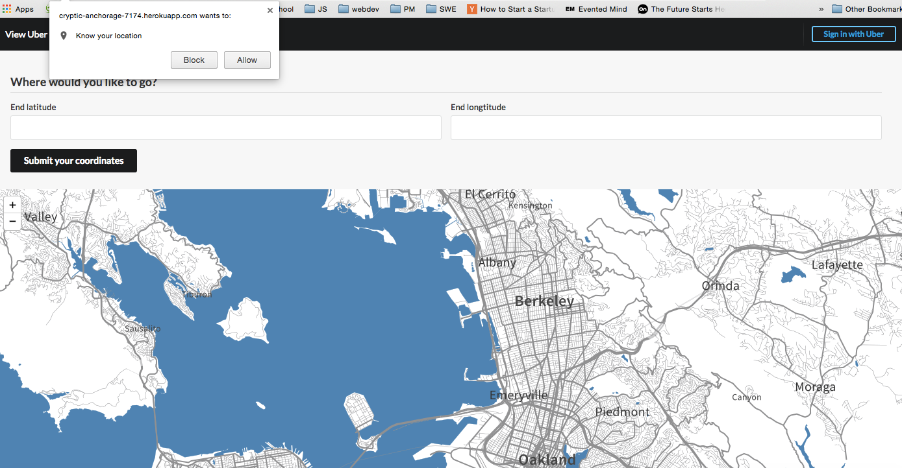

== README

HowFarCanYouGo app lets you find the ultimate Uber option for your trip. The app locates you based on geolocation, and asks for your destination. You can authenticate via your Uber account, and view your ride options.

Deployed on Heroku: https://cryptic-anchorage-7174.herokuapp.com/

Stack: Rails 4, PostgreSQL, oAuth, Uber API, Mapbox/Leaflet API.

* Configuration

  * Ruby 2.2.0

  * Rails 4.2.0

  * Database creation:
  <tt>rake db:drop db:create db:migrate</tt>

  * Database initialization:
  <tt>rails server or rails s</tt>

  * <strong>Important Note</strong>: As per Uber API documentation, "the Uber API implements the OAuth 2.0 standard for secure authentication and authorization. All communication with Uber servers must be over SSL (https://)" (Refer to [Uber API Authentication docs](https://developer.uber.com/v1/auth/)). To run the app, user proxy service to get https:// URL to make secure requests from instead of localhost.

* Under development: requesting Rides to your location w/ /v1/requests endpoint.

* Screenshots:

(a) Homepage 1: allow geolocation to get your current location

(b) Homepage 2: input & view end destination

(c) Uber Authentication Page: register or authenticate to login

(d) View Ride Options: preview price estimates, time duration & ride options

