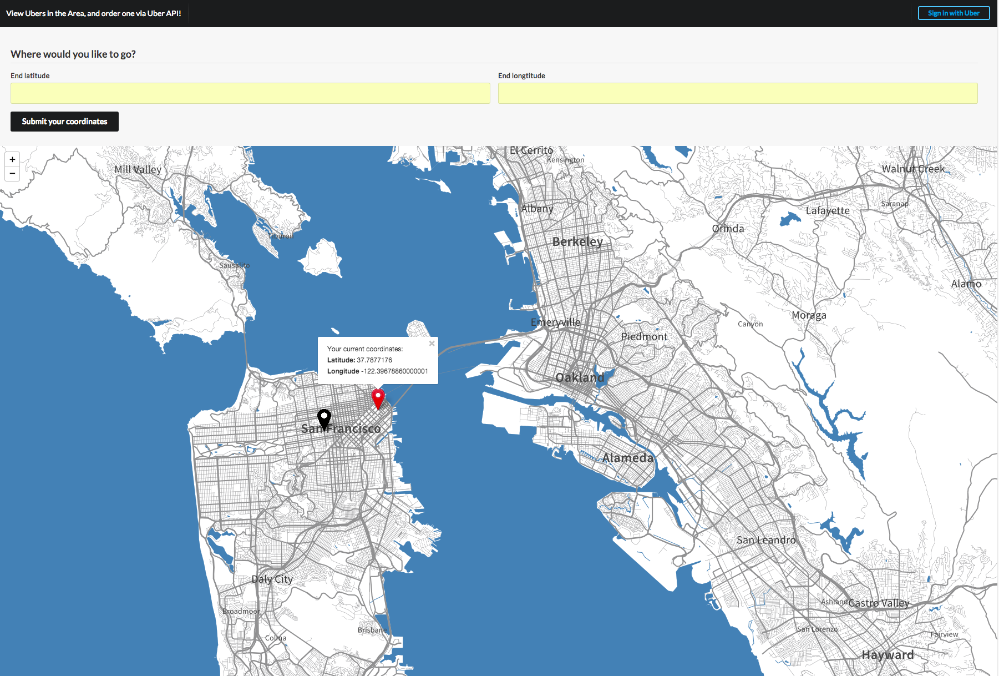
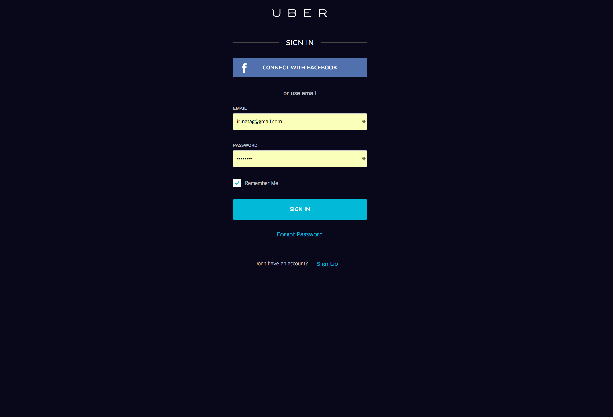
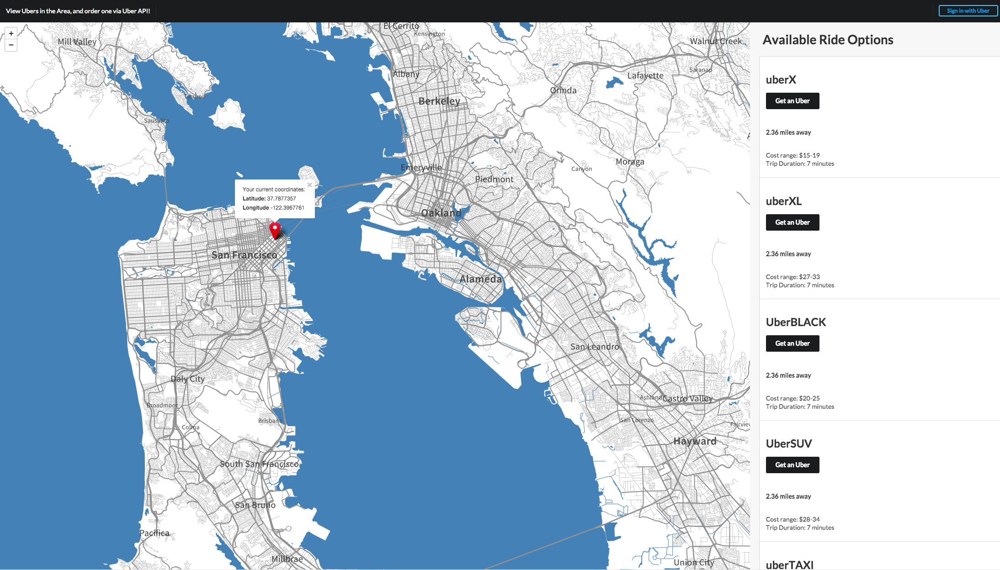

== README

HowFarCanYouGo app lets you find the ultimate Uber option for your trip. The app locates you based on geolocation, and asks for your destination. You can them authenticate via your Uber account, and view your ride options.

Stack: Rails 4, PostgreSQL, oAuth, Uber API, Mapbox/Leaflet API.

* Configuration

  * Ruby 2.2.0

  * Rails 4.2.0

  * Database creation:
  <tt>rake db:drop db:create db:migrate</tt>

  * Database initialization:
  <tt>rails server or rails s</tt>

* Screenshots:

(a) Homepage: start and end destinations

(b) Uber Authentication Page: register or authenticate to login

(c) View Ride Options: preview price estimates, time duration & ride options

